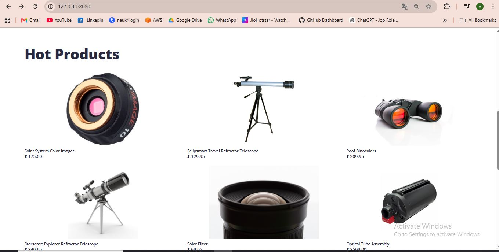
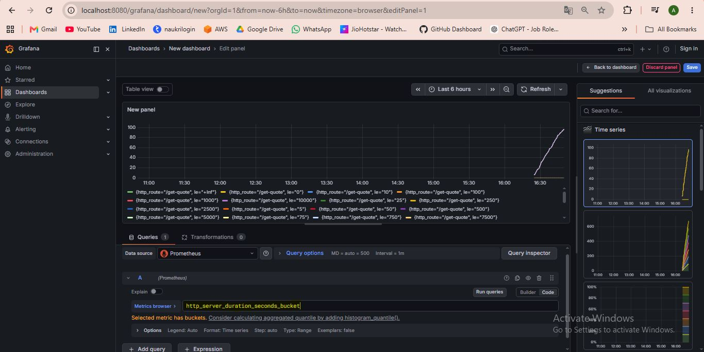
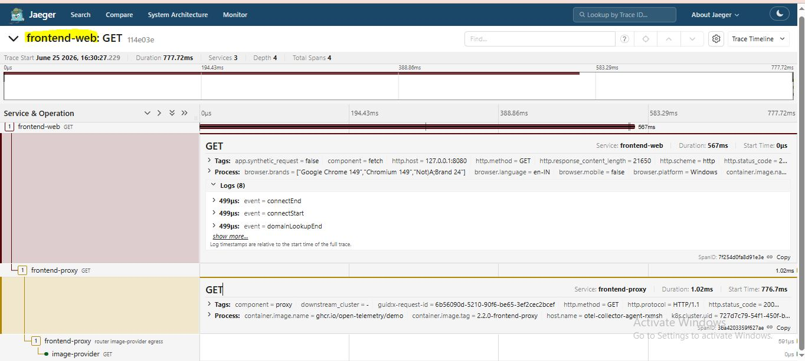

# OpenTelemetry Observability on Amazon EKS

## Overview

This project demonstrates the deployment of the OpenTelemetry Demo application on Amazon EKS to gain hands-on experience with cloud-native observability.

The environment provides end-to-end visibility into microservices through distributed tracing, metrics collection, monitoring dashboards, and telemetry data analysis.

## Technologies Used

* Amazon EKS
* Kubernetes
* Helm
* OpenTelemetry
* Prometheus
* Grafana
* Jaeger

## Architecture

The application consists of multiple microservices deployed on Amazon EKS.

Telemetry data is collected and processed using OpenTelemetry and visualized through industry-standard observability tools.

### Components

* OpenTelemetry Collector
* Prometheus
* Grafana
* Jaeger
* Frontend Proxy
* Load Generator
* Multiple Backend Microservices

## Features

### Distributed Tracing

Track requests across multiple microservices using Jaeger.

### Metrics Monitoring

Collect and monitor application metrics using Prometheus.

### Dashboards and Visualization

Visualize service health, resource utilization, and performance metrics using Grafana.

### Kubernetes Native Deployment

Deploy and manage observability workloads on Amazon EKS.

### Microservices Observability

Understand service dependencies, request flow, latency, and bottlenecks.

## Deployment Workflow

### Create Amazon EKS Cluster

Provision an Amazon EKS cluster and worker nodes.

### Deploy OpenTelemetry Demo

Deploy the OpenTelemetry Demo application using Helm.

### Generate Kubernetes Manifests

Render Kubernetes manifests from the Helm chart.

### Deploy Workloads

Apply the generated manifests to the EKS cluster.

### Access the Application

Use Kubernetes port forwarding to access the storefront and observability tools.

## Access Components

| Component        | Purpose                        |
| ---------------- | ------------------------------ |
| Web Store        | Demo Microservices Application |
| Grafana          | Monitoring Dashboards          |
| Jaeger           | Distributed Tracing            |
| Load Generator   | Generate Application Traffic   |
| Feature Flags UI | Feature Management             |

## Application Home Page

## Product Catalog

## Grafana Dashboard

## Jaeger Traces

