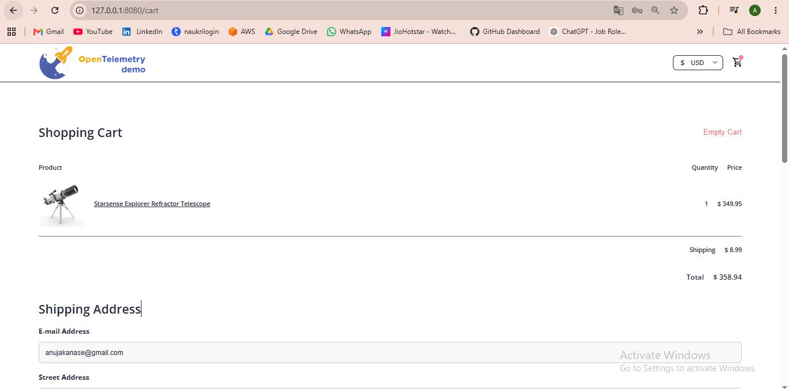

# OpenTelemetry Observability on Amazon EKS

## Overview

This project demonstrates the deployment of the OpenTelemetry Demo application on Amazon EKS to gain hands-on experience with cloud-native observability.

The environment provides end-to-end visibility into microservices through distributed tracing, metrics collection, monitoring dashboards, and telemetry data analysis.

## OpenTelemetry

OpenTelemetry (OTel) is an open-source observability framework used to collect, process, and export telemetry data from applications and infrastructure.

It provides a vendor-neutral standard for generating and managing the three pillars of observability:

* Metrics
* Logs
* Traces

OpenTelemetry is a CNCF project and has become the industry standard for observability in cloud-native environments.

---

### Why OpenTelemetry?

Modern applications are built using microservices, containers, and distributed systems. As applications grow, understanding system behavior becomes increasingly difficult.

OpenTelemetry helps teams:

* Monitor application performance
* Track requests across services
* Analyze system behavior
* Troubleshoot issues faster
* Improve application reliability

---

### OpenTelemetry Architecture

```text
Application Services
        │
        ▼
Instrumentation
        │
        ▼
OpenTelemetry SDK
        │
        ▼
OpenTelemetry Collector
        │
 ┌──────┼──────┐
 ▼      ▼      ▼
Metrics Logs Traces
 ▼      ▼      ▼
Prometheus OpenSearch Jaeger
      │
      ▼
   Grafana
```

---

### Core Components of OpenTelemetry

#### Instrumentation

Instrumentation generates telemetry data from applications.

Types:

* Automatic Instrumentation
* Manual Instrumentation

Instrumentation creates:

* Traces
* Metrics
* Logs

---

#### OpenTelemetry SDK

The SDK collects telemetry data generated by applications and prepares it for export.

Supported Languages:

* Java
* Python
* Go
* Node.js
* .NET
* PHP
* Ruby

---

#### OpenTelemetry Collector

The OpenTelemetry Collector is a vendor-neutral service responsible for receiving, processing, and exporting telemetry data.

Benefits:

* Centralized Telemetry Collection
* Data Transformation
* Filtering
* Routing
* Scalability

---

### Collector Pipeline

The OpenTelemetry Collector follows a pipeline model:

```text
Receivers → Processors → Exporters
```

#### Receivers

Receive telemetry data from applications.

Examples:

* OTLP
* Jaeger
* Zipkin
* Prometheus

#### Processors

Modify or enrich telemetry data.

Examples:

* Batch Processor
* Memory Limiter
* Resource Processor

#### Exporters

Send telemetry data to backend systems.

Examples:

* Prometheus
* Jaeger
* OpenSearch
* Grafana
* Logging Backends

---

### Role in This Project

In this OpenTelemetry Demo deployment:

* Microservices are instrumented using OpenTelemetry.
* Telemetry data is generated automatically.
* The OpenTelemetry Collector receives telemetry data.
* Metrics are exported to Prometheus.
* Traces are exported to Jaeger.
* Grafana visualizes collected metrics.

---

### Benefits of OpenTelemetry

* Vendor Neutral
* Open Standard
* Kubernetes Native
* Unified Telemetry Collection
* Scalable Architecture
* Multi-Language Support
* Cloud-Native Integration

---

### OpenTelemetry and Amazon EKS

OpenTelemetry integrates seamlessly with Kubernetes and Amazon EKS, making it easier to monitor distributed applications running in production environments.

It enables organizations to implement a complete observability strategy while maintaining flexibility to integrate with various monitoring, logging, and tracing platforms.

### Key Takeaway

OpenTelemetry acts as the foundation of modern observability by standardizing how telemetry data is generated, collected, processed, and exported. It provides complete visibility into cloud-native applications and enables efficient monitoring, troubleshooting, and performance optimization.

### Components

* OpenTelemetry Collector
* Prometheus
* Grafana
* Jaeger
* Frontend Proxy
* Load Generator
* Multiple Backend Microservices

## Features

### Distributed Tracing

Track requests across multiple microservices using Jaeger.

### Metrics Monitoring

Collect and monitor application metrics using Prometheus.

### Dashboards and Visualization

Visualize service health, resource utilization, and performance metrics using Grafana.

### Kubernetes Native Deployment

Deploy and manage observability workloads on Amazon EKS.

### Microservices Observability

Understand service dependencies, request flow, latency, and bottlenecks.

## Deployment Workflow

### Create Amazon EKS Cluster

Provision an Amazon EKS cluster and worker nodes.

### Deploy OpenTelemetry Demo

Deploy the OpenTelemetry Demo application using Helm.

### Generate Kubernetes Manifests

Render Kubernetes manifests from the Helm chart.

### Deploy Workloads

Apply the generated manifests to the EKS cluster.

### Access the Application

Use Kubernetes port forwarding to access the storefront and observability tools.

## Access Components

| Component        | Purpose                        |
| ---------------- | ------------------------------ |
| Web Store        | Demo Microservices Application |
| Grafana          | Monitoring Dashboards          |
| Jaeger           | Distributed Tracing            |
| Load Generator   | Generate Application Traffic   |
| Feature Flags UI | Feature Management             |

## Application Home Page


## Product Catalog




## Grafana Dashboard


## Jaeger Traces


